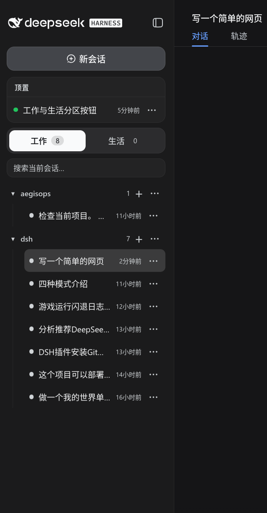

# dsh-wzone — 工作/生活会话分区插件

为 DSH Web 侧边栏增加「工作 / 生活 → 项目 → 会话」三级管理视图。它通过 DSH 官方 bundle/client 机制挂载，不修改 DSH 源码。



## 功能

- 工作 / 生活分区切换，显示各分区会话数量
- 项目按目录分组，会话可展开、搜索和快速打开
- 项目置顶、重命名、归档、删除，以及在项目中创建新会话
- 会话置顶、归档、复制为分支、跨分区移动
- 折叠侧边栏时显示工作 / 生活快捷按钮
- 数据保存在浏览器 `localStorage` 的 `dsh.wzone.v1`，刷新和重启 DSH 不会丢失

## 安装教程

### 方式一：从 GitHub 安装（当前可用）

当前版本从 GitHub 仓库安装：

```sh
git clone https://github.com/user27c/dsh-wzone.git
cd dsh-wzone
pnpm install
pnpm build
dsh plugin --profile web add link:$(pwd)
```

安装完成后退出正在运行的 DSH，再重新启动：

```sh
Ctrl+C
dsh web
```

打开浏览器后，如果页面仍是旧版本，执行一次硬刷新：

```text
Linux / Windows: Ctrl+Shift+R
macOS:            Cmd+Shift+R
```

重启后，侧边栏中会出现「工作 / 生活」切换按钮。项目会按 DSH 工作区分组，会话数据由 DSH 提供，分区、置顶和归档偏好保存在浏览器本地。

### 方式二：从 npm 安装

本仓库当前已发布到 GitHub，尚未发布到 npm。完成 npm 发布后，可直接使用：

```sh
dsh plugin --profile web add @linxin666/dsh-client-ui-wzone
```

### 本地开发

```sh
git clone https://github.com/user27c/dsh-wzone.git
cd dsh-wzone
pnpm install
pnpm build
dsh plugin --profile web add link:$(pwd)
```

源码修改后重新构建，再刷新浏览器即可：

```sh
pnpm build
```

### 常见问题

- **启动时报找不到包**：确认已经执行 `pnpm install` 和 `pnpm ... build`，并检查 profile 中的 link 路径没有指向已被清理的 `/tmp` 目录。
- **安装后看不到侧边栏**：重启 `dsh web`，再用 `Ctrl+Shift+R` / `Cmd+Shift+R` 硬刷新。
- **数据不见了**：插件数据位于当前浏览器 origin 的 `localStorage` 键 `dsh.wzone.v1`；不要清除站点数据。

## 聚合包

推荐安装全家桶聚合包：

```sh
dsh plugin --profile web add @linxin666/dsh-web-ui-all
```

聚合包会通过 `cordis.patch.yml` 自动注册本插件的 loader；不要同时手动安装本插件并手动追加同一个 `ui-wzone` loader，否则会造成重复挂载。

## 发布结构

本包包含：

- `src/index.ts`：host 半区入口
- `src/client/index.ts`：注册 `sidebar.workspaces` 槽位并注入样式
- `src/client/ZoneBrowser.tsx`：工作 / 生活分区界面
- `cordis.patch.yml`：注册 loader ID `ui-wzone`
- `lib/`：已构建的 host/client bundle

`package.json` 中的 `dsh.bundle.patch` 和 `dsh.client` 字段让官方 CLI 能够自动发现并挂载插件。

## 限制

插件依赖 DSH Web 提供的 `sessions`、`workspaces` 和 `sidebar.workspaces` 槽位。工作区、项目和会话的实际数据仍由 DSH 管理，本插件只负责分区、排序和浏览器端偏好设置。
